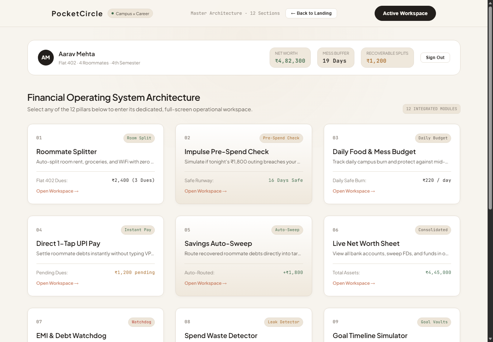
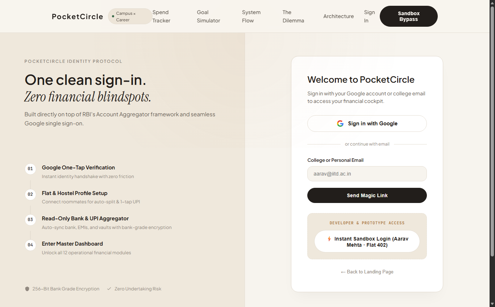

# PocketCircle 🪙⭕

> **The Campus-to-Career Financial OS**  
> Uniting informal dorm room bill splitting, proactive spend simulations, and goal-driven wealth building into one calm, intelligent ledger.

[](https://pocketcircle.vercel.app)
[](https://github.com/nikhillakra2007-tech/pocketcircle)
[](LICENSE)

---

## 🌐 Live Production Deployment
**Access the live application here:**  
👉 **[https://pocketcircle.vercel.app](https://pocketcircle.vercel.app)**

---

## 📸 Interface Previews

### 1. Editorial Landing Experience
*Clean, negative-space typography and interactive spend & goal simulation.*


---

### 2. Master 12-Pillar Financial Operating System
*Interactive operational cockpit covering roommate splits, daily runway, sweep vaults, and net worth.*



---

### 3. Identity Protocol & Account Aggregator
*Frictionless authentication built for students and early earners with instant sandbox bypass.*



---

## 🎯 The Dilemma: Why PocketCircle?

Traditional banking and finance applications are built for corporate executives moving money between corporate accounts. Existing consumer apps suffer from clear structural limitations:

| Platform | Strengths | The Missing Link |
| :--- | :--- | :--- |
| **Splitwise** | Informal group splits | Money sits idle; zero proactive budgeting or wealth building. |
| **INDmoney / Fi** | Wealth tracking & investments | Heavy, formal, detached from day-to-day campus roommate realities. |
| **PocketCircle** | **Unified Campus OS** | **Bridges dorm bills + daily spend runway + automated investment vaults in one loop.** |

---

## 🏛️ The 12 Pillars of PocketCircle

1. **Roommate Splitter**: Auto-split room rent, groceries, and WiFi with zero awkward money talks.
2. **Impulse Pre-Spend Check**: Proactively simulate whether a late-night ₹1,800 purchase breaches your monthly safety threshold.
3. **Daily Food & Mess Budget**: Real-time runway tracking to protect against mid-month cash crunches.
4. **Direct 1-Tap UPI Pay**: Integrated UPI intent generator that settles roommate debts without copying VPAs or phone numbers.
5. **Savings Auto-Sweep**: Automatically sweeps recovered peer dues into your prioritized Goal Vaults instead of letting cash rot as idle balances.
6. **Live Net Worth Sheet**: Consolidated view of bank balances, fixed deposits, and mutual funds.
7. **EMI & BNPL Watchdog**: Protect your early credit score from predatory student loan apps.
8. **Spend Waste Detector**: Highlights recurring micro-leaks (cabs, food delivery surcharges, unused subscriptions).
9. **Goal Timeline Simulator**: Forward-looking projection engine for tech upgrades, semester trips, and first-apartment deposits.
10. **Peer Credit Karma Score**: Social trust metric based on on-time peer bill settlement.
11. **First Paycheck Transition**: Pre-configured allocation blueprints for students receiving their first salary or internship stipend.
12. **Emergency Safe Buffer**: An untouchable liquidity cushion ensuring campus essentials are always covered.

---

## ⚡ Tech Stack & Architecture

- **Core**: Semantic HTML5, Vanilla JavaScript (ES6+ modular state and view router)
- **Styling**: Tailored CSS Design System with warm linen, cashmere, and terracotta editorial minimalism
- **Typography**: Google Fonts (*Plus Jakarta Sans*, *Instrument Serif*, *JetBrains Mono*)
- **Deployment**: [Vercel](https://vercel.com) Edge Network with instant cache invalidation
- **Zero Heavy Dependencies**: Blazing fast load times with zero third-party build friction.

---

## 🚀 Running Locally

Clone the repository and open directly in your browser or run with any static server:

```bash
# Clone the repository
git clone https://github.com/nikhillakra2007-tech/pocketcircle.git

# Navigate to the folder
cd pocketcircle

# Run with python (or npx serve)
python -m http.server 3000
```

Then visit `http://localhost:3000` in your browser.

---

## 📄 License
MIT © 2026 [nikhillakra2007-tech](https://github.com/nikhillakra2007-tech).
